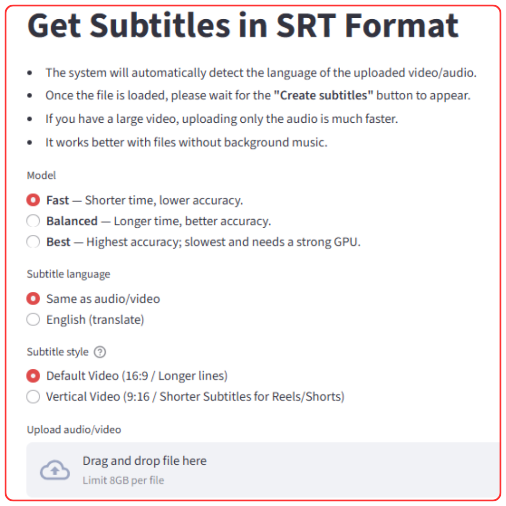

# GetSubtitlesApp

[](https://huggingface.co/spaces/KaanGoker/GetSubtitlesApp)
[](https://github.com/KaanGoker/GetSubtitlesApp/tree/main?tab=License-1-ov-file)

**GetSubtitles** automatically generates accurate subtitles for video or audio files in 99 languages. The application can also translate subtitles from any of those languages into English. 

It features a **special mode designed for vertical videos**, creating the short, fast-paced captions ideal for platforms like Instagram Reels, YouTube Shorts, and TikTok.

Powered by OpenAI's Whisper model, the app ensures high-accuracy transcriptions.

**The Problem It Solves**
While modern video editing software offers automatic subtitles, this feature is often limited to English and a handful of other popular languages. For creators working with less common languages, generating subtitles remains a tedious, manual task.

**The Solution**
GetSubtitles was built to solve this. It's a simple, user-friendly desktop application that delivers accurate .srt subtitle files, saving creators from hours of manual work, no matter what language they speak.

<h2 align="center">
  <strong>
    <a href="https://huggingface.co/spaces/KaanGoker/GetSubtitlesApp" target="_blank">
      🚀 Click Here to Try the App Live on Hugging Face! 🚀
    </a>
  </strong>
</h2>

<p align="center">
  
</p>

---

## ✨ Features
-   **Automatic Language Detection**: No need to specify the source language.
-   **Transcription & Translation**: Generate subtitles in the original language or translate them to English.
-   **Multiple Models**: Choose between `Fast`, `Balanced`, and `Best` models to balance speed and accuracy.
-   **Subtitle Styles**: Optimize subtitles for standard `16:9` videos or `9:16` vertical videos (Reels, Shorts).
-   **Simple UI**: Clean and intuitive interface powered by Streamlit.
-   **Cross-Platform**: Works on Windows (via `.exe`) and on any system with Docker.

---

## 💻 Usage For Windows Users

1.  **Download**: Go to the [**Releases**](https://github.com/KaanGoker/GetSubtitlesApp/releases) page and download the latest `.zip` file (e.g., `GetSubtitles-v1.0.zip`).
2.  **Extract**: Unzip the downloaded file into a new folder.
3.  **Run**: Double-click on `GetSubtitles.exe`. The application will open in your web browser automatically.

**Note**: Your PC must have an internet connection the first time you run the app. It needs to download the AI models to work. This can take some time, especially if you choose the "Best" quality model. This is a one-time download.

## 🛠️ For Developers

### 1. Running from Source

If you want to contribute to the project or run it directly from the source code without Docker:

1.  **Clone the repository**:
    ```bash
    git clone https://github.com/KaanGoker/GetSubtitlesApp.git
    cd GetSubtitlesApp
    ```

2.  **Set up your environment**:
    It is highly recommended to use a Python virtual environment. Once activated, install the required dependencies:
    ```bash
    pip install -r requirements.txt
    ```

3.  **Run the servers**:
    You will need to run the backend server (FastAPI) and the frontend server (Streamlit) in two separate terminals.

    * **In Terminal 1 (Run Backend):**
        ```bash
        uvicorn app.main:app --reload
        ```

    * **In Terminal 2 (Run Frontend):**
        ```bash
        streamlit run streamlit_app.py
        ```
    The application will start and open in your web browser automatically.

---

### 2. Using Docker (macOS, Linux, Windows Pro)

This method works on any system with Docker. We provide two options.

**Prerequisites**:
-   Docker must be installed.

---

**Method A: Quick Start**
This method uses pre-built images from the GitHub Container Registry (ghcr.io) and is the fastest way to get started.

1.  Download the `docker-compose.prod.yml` file from this repository.
2.  In the same folder, run the application from your terminal:
    ```bash
    docker-compose -f docker-compose.prod.yml up
    ```
    This command will pull the finished images from GitHub and start them.

**Accessing the Application:**
Once the containers are running, open your web browser and navigate to:
**`http://localhost:8501`**

---

**Method B: Build from Source**
Use this method if you want to modify the code and build the images yourself.

1.  Clone the repository:
    ```bash
    git clone https://github.com/KaanGoker/GetSubtitlesApp.git
    cd GetSubtitlesApp
    ```
2.  Build and run the services (using the standard `docker-compose.yml` file):
    ```bash
    docker-compose up --build
    ```
    This will build the images locally, which can take time, especially for the backend.

**Accessing the Application:**
Once the containers are running, open your web browser and navigate to:
**`http://localhost:8501`**

---

## 3. Building the Windows Executable

These instructions are for developers who want to rebuild the `.exe` files from the source code using **PyInstaller**.

1.  **Install PyInstaller**:
    ```bash
    pip install pyinstaller
    ```

2.  **Prerequisite: Add `ffmpeg`**:
    * Download a **static `ffmpeg.exe` build** (e.g., from [gyan.dev](https://www.gyan.dev/ffmpeg/builds/)).
    * Create a `bin` folder in the root of the project.
    * Place the `ffmpeg.exe` file inside it. The final path must be `bin/ffmpeg.exe`.

3.  **Build the Backend (PowerShell)**:
    Run the following command to build the server executable. The backticks (` ` `) are for line continuation in PowerShell.
    ```powershell
    pyinstaller .\server_entry.py `
      --name GetSubtitlesServer `
      --onefile `
      --noconsole `
      --icon ".\icon assets\getsubtitleserver.ico" `
      --add-binary "bin\ffmpeg.exe;bin" `
      --add-data "icon assets;icon assets" `
      --hidden-import ctranslate2 `
      --hidden-import faster_whisper `
      --hidden-import uvicorn.lifespan `
      --hidden-import uvicorn.loops.auto `
      --hidden-import uvicorn.protocols.http.auto `
      --hidden-import uvicorn.protocols.websockets.auto `
      --hidden-import uvicorn.workers `
      --clean
    ```

4.  **Build the Frontend (PowerShell)**:
    Next, run this command to build the main UI executable.
    ```powershell
    pyinstaller .\ui_entry.py `
      --name GetSubtitles `
      --onefile `
      --noconsole `
      --icon ".\icon assets\getsubtitles.ico" `
      --add-data "streamlit_app.py;." `
      --add-data "icon assets;icon assets" `
      --hidden-import streamlit.web.bootstrap `
      --hidden-import streamlit.runtime `
      --hidden-import streamlit.runtime.scriptrunner `
      --hidden-import streamlit.runtime.scriptrunner.magic_funcs `
      --copy-metadata streamlit `
      --collect-data streamlit `
      --clean
    ```

5.  **Final Output**:
    The final executable files (`GetSubtitles.exe` and `GetSubtitlesServer.exe`) will be created in the `dist/` folder.

---

## 📄 License

This project is licensed under the MIT License. See the LICENSE file for details.

## 🙏 Acknowledgements

-   This tool is powered by OpenAI's Whisper.
-   The user interface is built with Streamlit.
-   The backend is served by FastAPI.